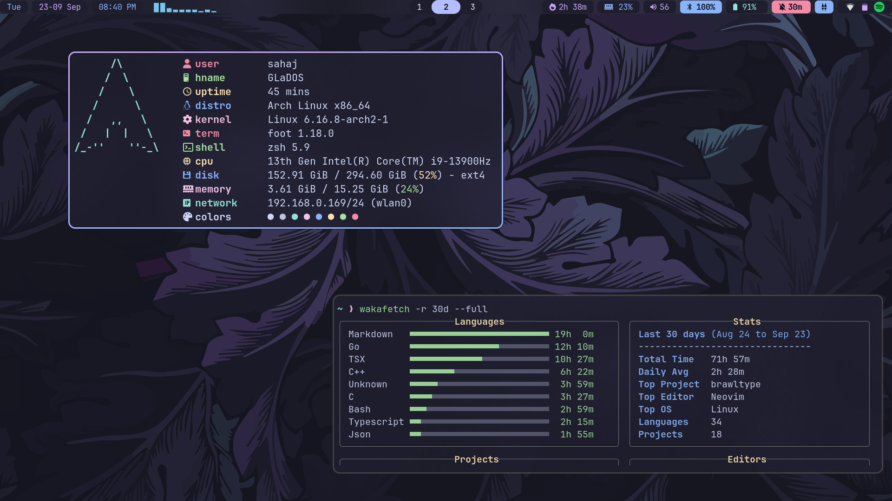

  

## Checkout my cool scripts in [scripts directory](scripts)

## Setup Overview
- **WM**: Hyprland
- **Terminal**: Foot
- **Shell**: Zsh
- **Font**: JetBrains Mono Nerd Font
- **Editor**: Neovim
- **Bar**: Waybar
- **Launcher**: Vicinae  
- **Notifications**: Mako
- **File Manager**: Yazi
- **Theme**: Catppuccin Mocha

## Config files

### Core
- [Hyprland](.config/hypr/hyprland.conf) - Main compositor config
- [Hypridle](.config/hypr/hypridle.conf) - Idle management  
- [Waybar](.config/waybar/) - Status bar (custom component's scripts are in [scripts/waybar](scripts/waybar))
- [Foot](.config/foot/foot.ini) - Terminal  
- [Vicinae](.config/vicinae/vicinae.json) - Launcher
- [Mako](.config/mako/config) - Notification daemon
- [Swaylock](.config/swaylock/config) - Screen locker

### Development
- [Neovim](.config/nvim/) - Editor. Fully customized beast
- [Tmux](.config/tmux/tmux.conf) - Terminal multiplexer  
- [OpenCode](.config/opencode/) - AI assistant in terminal
- [MCPHub](.config/mcphub/servers.json) - MCP servers config for mcphub.nvim
- [VSCode](.config/Code/User/) - I tried to replicate my nvim workflow
- [Cursor](.config/Cursor/User) - I tried to replicate my nvim workflow

### Applications & Misc
- [MPV](.config/mpv/) - Media player with uosc interface
- [Btop](.config/btop/) - System monitor
- [Yazi](.config/yazi/) - File manager
- [Mods](.config/mods/mods.yml) - AI in terminal
- [GTK3](.config/gtk-3.0/settings.ini) - GTK 3 theming
- [GTK4](.config/gtk-4.0/settings.ini) - GTK 4 theming

### Shell & Prompt
- [Zsh](.zshrc) - Shell configuration
- [Starship](.config/starship/starship.toml) - Cross-shell prompt

### Archived / No Longer in Use
- [Fuzzel](.config/fuzzel/fuzzel.ini) - Application launcher
- [Dunst](.config/dunst/dunstrc) - Notification daemon
- [Wofi](.config/wofi/) - Application launcher
- [Alacritty](.config/alacritty/alacritty.toml) - Terminal emulator
- [Ghostty](.config/ghostty/config) - Terminal emulator

*Feel free to steal whatever you want from this setup 🏴‍☠️*
